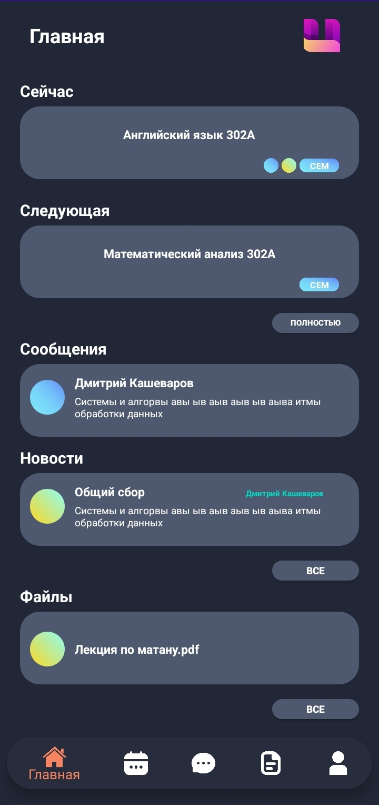
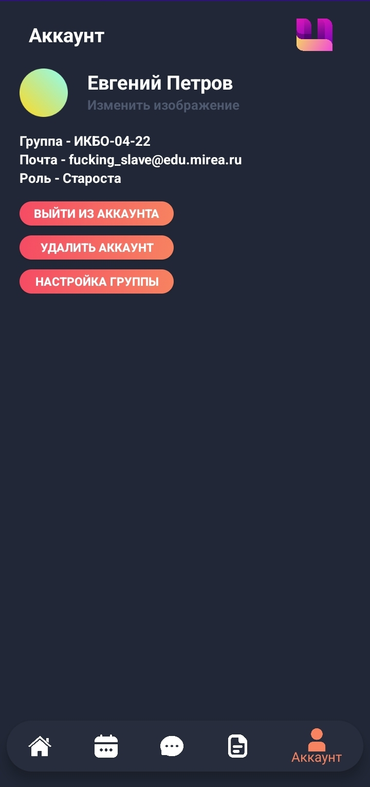
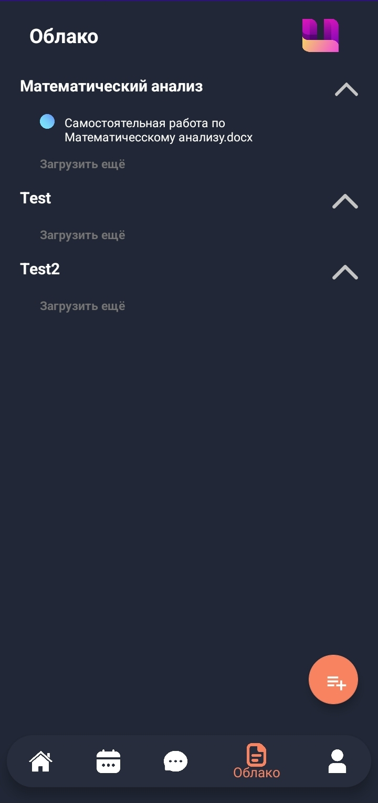
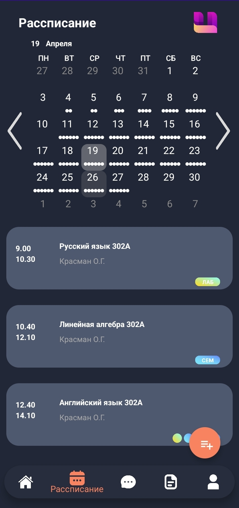

<h1 align="center">
  <br>
  <a href=""></a>
  <br>
  UMIREA
  <br>
</h1>

___

<h4 align="center">
Umirea - Learning activities manager

<p align="center">
  <a href="#key-features">Key Features</a> •
  <a href="#how-to-use">How To Use</a> •
  <a href="#build">How To Build</a> 
</p>

[](http://forthebadge.com)
[](http://forthebadge.com)

## Key Features

* Viewing the schedule
* Adding homework
* Adding notes
* Group chat
* File storage
* News system

## How To Use

* To use the app, go to the [release](https://github.com/ArhostCode/umirea/releases/) section and download the latest
  version from there.
* Install the apk file.

## How To Build

To clone and build this application, you'll need [Git](https://git-scm.com)
and [Intellij Idea](https://www.jetbrains.com/idea/) or [Android Studio](https://developer.android.com/studio)
installed on your computer.
From your command line

```bash
# Clone this repository
$ git clone https://github.com/ArhostCode/umirea
```

* Open umirea-android project in Android Studio to build android app.
* Open umirea-backend project in Intellij Idea to build backend.
  <br> Use docker-compose to up backend

```bash
# Clone this repository
$ cd umirea-backend
$ docker-compose up
```

> **Note**
> If you want to up backend with docker-compose, you need [Docker](https://www.docker.com/)

## Tech Stack

**Client:** Android, Java, Room

**Server:** Quarkus, Spring MVC, MariaDB

## Screenshots

<p float="left">




</p>

___

> VK [ardycode](https://vk.com/ardycode) &nbsp;&middot;&nbsp;
> GitHub [@arhostcode](https://github.com/ArhostCode)